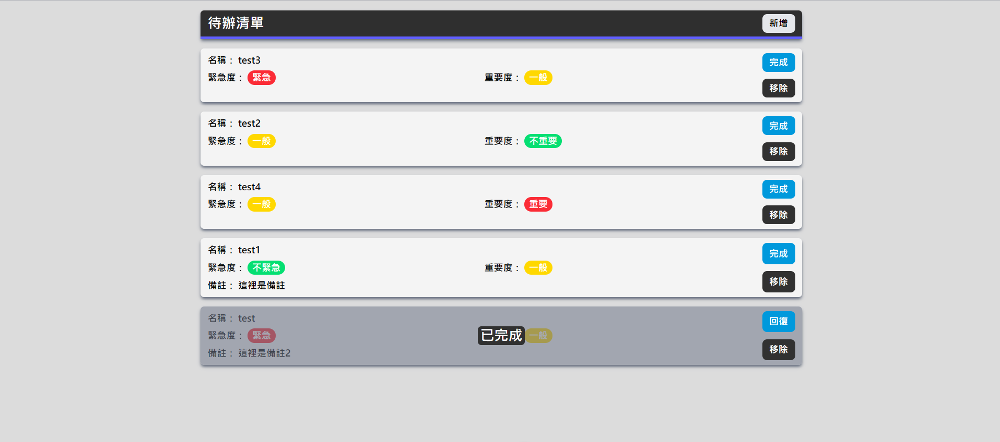

# TodoList
一個使用 Vue 3 與 Tailwind CSS 製作的待辦清單
## Screenshot


## Features
- 可以新增待辦事項，能選擇緊急度、重要度或填寫備註
- 記憶待辦狀態，每次打開自動渲染
- 待辦事項會依照緊急度排序
- 完成的事項會自動排在底部，可以回復為未完成狀態

## Tech Stack
- Vue 3
- Vite
- Tailwind CSS

## Installation

```bash
npm install
npm run dev
